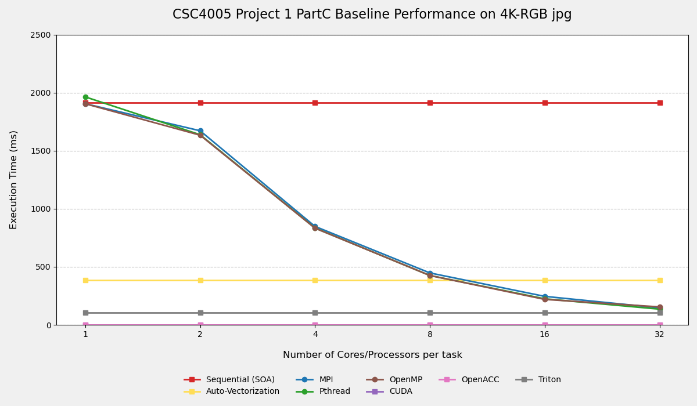

# Project 1: Parallel Programming Report

## 1. How to Compile and Execute

The project is compiled and executed according to the `README.md`.

### Compilation

```bash
# Navigate to the project directory
cd /path/to/project1

# Create a build directory
mkdir build && cd build

# Generate build files with CMake in Release mode
# Use `cmake3` in Docker, `cmake` on the cluster
cmake -DCMAKE_BUILD_TYPE=Release ..

# Compile the project using 8 cores
make -j8
```

### Execution

The programs are run on the cluster using the provided sbatch script.

```bash
# Navigate to the project directory
cd /path/to/project1

# Submit the job script for Part C
sbatch ./src/scripts/sbatch_PartC.sh
```

## 2. Parallel Programming Models

This project uses two main types of parallelism:

#### Data-Level Parallelism (DLP)

DLP focuses on applying the same operation to many data elements at the same time. This is a great fit for image processing.

- **Auto-Vectorization**: Uses special CPU instructions (SIMD) to perform a single operation on a vector of data (e.g., multiple pixels) at once.
- **CUDA / OpenACC / Triton**: Uses the GPU's thousands of cores to run the same kernel function on different data (pixels) simultaneously. This is a Single Instruction, Multiple Threads (SIMT) model.

#### Task-Level Parallelism (TLP)

TLP focuses on splitting a large task into smaller sub-tasks that can run concurrently on different CPU cores.

- **Pthread / OpenMP**: These are thread-based models for shared-memory systems. Multiple threads are created to process different sections of the image. The threads share access to the entire image in memory.
- **MPI**: This is a process-based model for distributed-memory systems. It creates multiple processes, each with its own private memory. They work on different sections of the image and explicitly send messages to each other to share data (like boundary pixels).

## 3. CUDA Program Optimizations

For Part C, the CUDA implementation was optimized progressively, improving performance from an initial **4.096 ms** to a final **1.363 ms**.

- **Baseline (4.096 ms)**: A simple implementation where all data was read from and written to global memory.
- **Constant Memory (2.994 ms)**: Moved read-only filter parameters to the GPU's cached constant memory for faster access.
- **Shared Memory (2.007 ms)**: Used a tiling strategy to load blocks of the image into fast on-chip shared memory. This greatly reduced slow global memory reads for neighborhood calculations.
- **Lookup Table for `expf` (1.545 ms)**: Replaced the computationally expensive `expf` function call with a pre-computed lookup table to trade precision for speed.
- **Increased Thread Workload (1.394 ms)**: Modified the kernel so each thread calculates multiple output pixels. This reduced the relative overhead of thread scheduling.
- **Texture Memory (1.363 ms)**: Bound the input image to texture memory, which has a 2D-optimized cache that is ideal for image processing access patterns.

## 4. Part C Experimental Results & Analysis

The following results are for the Part C bilateral filter on a 4K image. The serial (Structure-of-Array) execution time of **1913 ms** is the baseline for speedup calculations.

| Model                | Cores/Processes (p) | Time (ms) | Speedup (S_p) | Efficiency (E_p) |
| :------------------- | :------------------ | :-------- | :------------ | :--------------- |
| **Sequential (SoA)** | 1                   | 1913      | 1.00          | 100.0%           |
| **Vectorization**    | 1 (SIMD)            | 386       | 4.96          | -                |
| **MPI**              | 1                   | 1905      | 1.00          | 100.0%           |
|                      | 2                   | 1672      | 1.14          | 57.0%            |
|                      | 4                   | 848       | 2.26          | 56.5%            |
|                      | 8                   | 447       | 4.28          | 53.5%            |
|                      | 16                  | 245       | 7.81          | 48.8%            |
|                      | 32                  | 146       | 13.10         | 40.9%            |
| **Pthread**          | 1                   | 1964      | 1.00          | 100.0%           |
|                      | 2                   | 1638      | 1.17          | 58.5%            |
|                      | 4                   | 834       | 2.29          | 57.3%            |
|                      | 8                   | 425       | 4.50          | 56.3%            |
|                      | 16                  | 224       | 8.54          | 53.4%            |
|                      | 32                  | 135       | 14.17         | 44.3%            |
| **OpenMP**           | 1                   | 1905      | 1.00          | 100.0%           |
|                      | 2                   | 1634      | 1.17          | 58.5%            |
|                      | 4                   | 833       | 2.30          | 57.5%            |
|                      | 8                   | 425       | 4.50          | 56.3%            |
|                      | 16                  | 219       | 8.73          | 54.6%            |
|                      | 32                  | 154       | 12.42         | 38.8%            |
| **CUDA (Optimized)** | GPU                 | 1.37      | **1396.35**   | -                |
| **OpenACC**          | GPU                 | 2.00      | 956.50        | -                |
| **Triton**           | GPU                 | 106.05    | 18.04         | -                |



### Analysis

- **CPU Performance**: Pthread, OpenMP, and MPI all show good scaling. Pthread performs best among CPU models, achieving a **14.17x** speedup with 32 cores. Efficiency decreases as core count increases, likely due to memory bandwidth limits and overhead.
- **GPU Performance**: GPU models are dramatically faster. The optimized CUDA version is nearly **100 times faster** than the best 32-core Pthread result. The speedup compared to the serial version is over **1300x**.

## 5. Findings and Comparison

Comparing the results across Parts A, B, and C reveals key insights.

- **Computational Complexity Matters**: Part C (Bilateral Filter) is far more computationally intensive than Part A (Grayscale) and Part B (Blur) because of its complex weighting formula involving an `expf` call.
- **Higher Speedup in Part C**: Because Part C has a higher ratio of computation to memory access, the parallel portions of the code dominate the runtime. This allows for greater speedups, as described by Amdahl's Law. In contrast, the simpler Parts A and B become memory-bound more quickly, limiting their scalability.
- **GPU Advantage Is Magnified**: The GPU's massive performance advantage is most apparent in Part C. Its architecture excels at hiding the high latency of calculations like `expf` by executing thousands of threads concurrently. When one group of threads is waiting for a calculation, the GPU executes another, keeping the hardware busy. This makes the GPU exceptionally well-suited for computationally demanding tasks.
