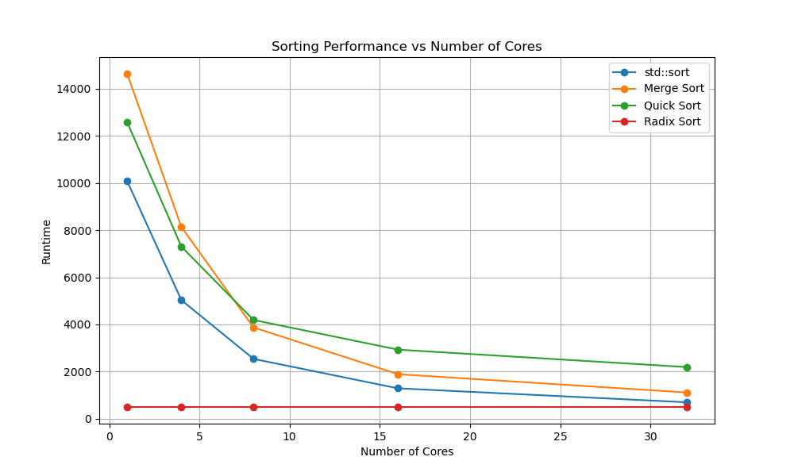
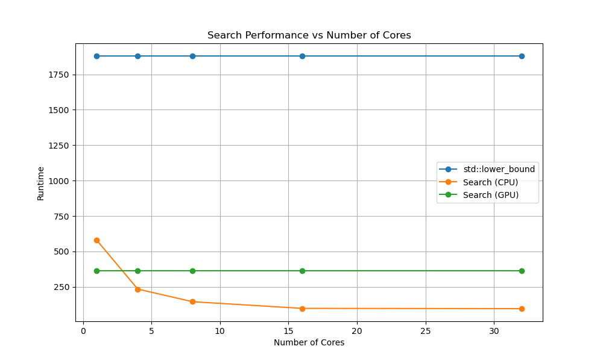

# Project 3: Parallel Sorting & Searching Algorithms Report

## 1\. How to Compile and Execute

The project is compiled and executed according to the `README.md`.

### Compilation

```bash
cd /path/to/project3
mkdir build && cd build
# Change to -DCMAKE_BUILD_TYPE=Debug for debug build error message logging
# Here, use cmake on the cluster and cmake3 in your docker container
cmake -DCMAKE_BUILD_TYPE=Release ..
make -j4
```

### Execution

All jobs are submitted to the Slurm cluster using the provided script.

```bash
# Use sbatch
cd /path/to/project3/src
sbatch ./sbatch.sh
```

## 2\. Algorithm Design and Implementation

### Task 1: Parallel Merge Sort (CPU)

1.  **Parallel Recursion (`parMergeSort`):**

    - The `parMergeSort` function uses OpenMP `taskgroup` and `task` directives to parallelize the recursive calls for the left and right halves of the array.
    - To prevent oversubscription and task creation overhead, this task-based parallelism is only active for `depth < max_depth`, where `max_depth` is set to `log2(thread_num)`.
    - A base case optimization is used: for subarrays of 64 elements or fewer, the algorithm switches to `insertionSort`, which is more efficient for small arrays.
    - The implementation uses "ping-pong" strategy suggested by ChatGPT to reduce bandwith requirements, sorting from vector `src` to vector `dest`.

2.  **Parallel Merge (`parMerge`):**

    - As hinted in the `README`, I implement the `findSplit` function which is an $O(\log(\min(n_1, n_2)))$ algorithm to find the `k`-th element of two sorted subarrays.
    - `parMerge` calls `findSplit` to find the median. It then creates two new `omp task`s to concurrently merge the two lower-half sections (into `dest[0...k-1]`) and the two upper-half sections (into `dest[k...end]`).
    - If the total size of the merge is small (`< 2048`) or max depth is reached, it falls back to a `sequentialMergeHelper`.

### Task 2: Parallel Quick Sort (CPU)

1.  **Parallel Recursion (`quickSort`):**

    - Similar to Merge Sort, this uses `omp task` directives to parallelize the recursive `quickSort` calls for the subarrays to the left and right of the pivot.
    - This is also depth-limited by `max_depth` to control task generation.

2.  **Parallel Partition (`partition_parallel`):**

    - This is an out-of-place partition algorithm using $O(n)$ extra space (`S` and `temp` arrays), as suggested in the `README`.
    - **Step 1 Find Pivot:** Compare vec[low], vec[mid], vec[high] to find the median as pivot to avoid worst time complexity
    - **Step 2 Compare:** An `omp taskloop` is used to concurrently compare all elements `vec[i]` to the `pivot`, storing the boolean result in the `S` array.
    - **Step 3 Prefix Sum:** It calls `prefix_sum_parallel` on the `S` array. It uses `omp task` to compute local sums for different blocks of the `S` array and each blocks is computed by a thread. After a `taskwait`, a serial pass computes the `block_offsets`, the starting write-offset for each thread. Finally, compute `num_small` as the starting position of large elements.
    - **Step 4 Scatter:** A set of `omp task`s are launched. Each thread iterates its chunk of `vec`, reads the corresponding value from `S`, and uses its `block_offsets` and a local prefix sum to calculate the destination index in the `temp` array. It writes small elements to the front (`temp[low + ...]`) and large elements to the back (`temp[low + num_small + ...]`).
    - **Step 5 Copy Back:** After a `taskwait`, `std::memcpy` is used to copy the partitioned data from `temp` back to `vec`.
    - **Optimization:** This complex parallel partition is only used for large subarrays (`> 65536`). For smaller arrays, it falls back to a standard, in-place `partition_sequential`.

### Task 3: Parallel Radix Sort (GPU)

1.  **Step 1 Reset `local_counts`:** A `parallel loop collapse(2)` zeros the `local_counts[NUM_GANGS][BASE]` histogram.
2.  **Step 2 Local Histogram:** `NUM_GANGS` gangs are launched. Each gang processes a `chunk_size` of the input. Workers/vectors find the digit `d` for each element and use `atomic update` to increment `local_counts[gid][d]`.
3.  **Step 3 Global Histogram:** A parallel loop over `BASE` (0-255). An inner `loop vector reduction(+:sum)` sums all `local_counts[g][b]` for each bin `b` into the global `count[b]`.
4.  **Step 4 Global Prefix Sum:** A `serial` kernel computes the exclusive prefix sum on `count` to produce `start_pos`, the global starting position for each digit.
5.  **Step 5 Gang Prefix Sum:** A parallel loop over `BASE`. An inner `loop seq` computes the prefix sum across gangs and stores it in `gang_prefix_sum[g][b]`.
6.  **Step 6 Gang Offsets:** A `parallel loop collapse(2)` computes the final write offset for each gang and digit.
7.  **Step 7 Scatter:**
    - It is tiled (`tile_size = 2048`) to improve cache locality.
    - **Tile Histogram:** A local `tile_count` array is computed for the current tile.
    - **Atomic Offset Capture:** In a `seq` loop, it uses `atomic capture` to atomically read the current write position from `local_offsets[gid][d]` into `tile_base[d]` and simultaneously increment `local_offsets` by `tile_count[d]`. This claims a write-space for the tile.
    - **Tile Scatter:** A final `seq` loop scatters elements from `vec_raw` into `output` using the `tile_base` offsets.
8.  **Step 8 Copy Back** A simple `parallel loop` copies the sorted `output` back to `vec_raw` for the next pass.

### Task 4: Parallel Search (CPU)

- **Distribute Work:** The workload is split among OpenMP threads.
- **Exponential Search:** As suggested in `README`, instead of starting a binary search on the large range `[0, vector_size-1]`, the algorithm first performs an exponential search. Each thread maintains a `left_hint`, which stores the `result` of its previous search. Since `search_targets` is sorted, the current target `search_targets[i]` must be found at or after the location of `search_targets[i-1]`, which is the `left_hint`. It probes `vec[left_hint + step]` (where `step` doubles: 1, 2, 4, 8...) until it finds an element `vec[right_bound_idx] >= target`.
- **Bounded Binary Search:** This exponential search finds a very tight range `[new_left, new_right]`. Only then is `binarySearch` called on this much smaller, cache-friendly range.

### Task 5: Parallel Search (GPU)

- **Distribute Work:** A simple `acc parallel loop` is used to launch one search per GPU vector thread.
- **Key Optimization: Branchless Binary Search:** The `binarySearch` function is designed to eliminate all branch divergence, as hinted in the `README`.
  - It uses a bitwise loop `step = 1 << bits; step > 0; step >>= 1` instead of a `while(l <= r)` loop.
  - Inside the loop, it computes a `valid` flag: `register int valid = pos < size && vec[safe] < target;`.
  - The index is updated using multiplication: `idx += valid * step;`.
- `register` keyword is used for loop-local variables to encourage use of registers and reduce memory spills.

## 3\. Experiment Results and Performance Analysis

### 3.1. Sorting Algorithms

**Table 1: Sorting Algorithm Performance (Time in ms)**

| Algorithm  | 1 Core | 4 Cores | 8 Cores | 16 Cores | 32 Cores |
| :--------- | :----: | :-----: | :-----: | :------: | :------: |
| std::sort  | 10077  |  5031   |  2537   |   1288   |   696    |
| Merge Sort | 14636  |  8136   |  3871   |   1889   |   1111   |
| Quick Sort | 12579  |  7302   |  4189   |   2930   |   2190   |
| Radix Sort |  496   |    -    |    -    |    -     |    -     |


**Analysis:**

1.  **Quick Sort Performance:** My `Quick Sort` scales poorly, achieving only **5.74x** speedup. Its 32-core time (2190ms) is significantly slower than even 16-core `Merge Sort` (1889ms). This strongly suggests my parallel partition algorithm, while correct, has massive overhead.
2.  **GPU Dominance:** The `Radix Sort` is the clear winner, finishing in just **496ms**. This is **21.6x faster** than the 1-core `std::sort` baseline (10741ms) and **1.37x faster** than the 32-core `std::sort` (681ms). This highlights the massive throughput of GPUs for data-parallel tasks.

### 3.2. Search Algorithms

**Table 2: Search Algorithm Performance (Time in ms)**

| Algorithm        | 1 Core | 4 Cores | 8 Cores | 16 Cores | 32 Cores |
| :--------------- | :----: | :-----: | :-----: | :------: | :------: |
| std::lower_bound |  1880  |    -    |    -    |    -     |    -     |
| Search (CPU)     |  580   |   234   |   145   |    98    |    96    |
| Search (GPU)     |  364   |    -    |    -    |    -     |    -     |



**Analysis:**

1.  **CPU Scaling Limit:** The CPU search scales very well up to 16 cores, achieving a **5.92x** speedup. However, it hits a hard wall at 32 cores, where performance is almost identical (98ms vs 96ms). This strongly indicates the task has become memory-bound (likely by memory bandwidth or latency), and adding more cores provides no benefit.
2.  **GPU Performance:** The GPU (364ms) is faster than the 1-core CPU (580ms), but slower than the 4, 8, 16, and 32-core CPU results.

## 4\. Profiling Results & Analysis

### 4.1. Merge Sort vs. Quick Sort (32 Cores)

The `perf` data reveals the exact reason for Quick Sort's poor performance.

| Algorithm (32-core) |   cpu-cycles    | cache-misses | page-faults |
| :------------------ | :-------------: | :----------: | :---------: |
| Merge Sort          | 90,973,008,594  | 205,846,245  |   565,699   |
| Quick Sort          | 170,161,437,804 | 404,380,988  |   578,919   |

**Analysis:**
At 32 cores, our `Quick Sort` implementation uses **1.87x more CPU cycles**, **1.96x more cache misses** and **1.02x more page-faults** than `Merge Sort`.

This is a direct consequence of the `partition_parallel` algorithm. Its multiple $O(n)$ passes (Write to `S`, Read `S` for prefix-sum, Read `vec`/`S` to write `temp`, `memcpy` `temp` to `vec`) create a "write-after-read" and "write-after-write" pattern on a massive dataset that pollutes the cache.

In contrast, `parMerge` has a more predictable, streaming access pattern (read two sorted blocks, write one merged block), which the CPU's prefetchers can handle much more effectively, resulting in half the cache misses and far greater efficiency.

### 4.2. Parallel Search CPU Scaling

The `perf` data for the CPU search confirms our memory-bound hypothesis.

| Cores |   cpu-cycles   | cache-misses | page-faults |
| :---: | :------------: | :----------: | :---------: |
|   1   | 87,532,067,576 | 192,764,892  |   234,518   |
|   4   | 88,150,751,016 | 191,865,567  |   249,040   |
|   8   | 88,255,077,179 | 191,970,168  |   247,378   |
|  16   | 88,333,082,404 | 191,960,759  |   242,011   |
|  32   | 89,737,964,401 | 192,295,624  |   239,775   |

**Analysis:**
This data is remarkable. The **total number of CPU cycles, cache misses and page-faults remains almost perfectly constant** as we increase the core count. We are not reducing the work; we are simply parallelizing a fixed number of memory stalls. The speedup seen in Table 2 comes _entirely_ from distributing this fixed work over more cores. The performance wall at 32 cores signifies the memory subsystem is fully saturated, and adding more compute units cannot service the memory requests any faster.

### 4.3. GPU Profiling Analysis

#### 4.3.1. Radix Sort (GPU)

**Analysis:**

- **Execution Time Distribution:** The total CUDA API time is split between three main components:
  - **Host-to-Device (HtoD) Copy:** `cuMemcpyHtoDAsync_v2` takes **109,466,732 ns** (25.2% of API time).
  - **Device-to-Host (DtoH) Copy:** `cuMemcpyDtoHAsync_v2` takes **95,461,917 ns** (21.9% of API time).
  - **Kernel Execution:** `cuStreamSynchronize`, which represents the host waiting for the GPU to finish work, is the largest bottleneck, consuming **228,415,067 ns** (52.5% of API time).
- **Kernel Bottleneck:** The CUDA GPU Kernel Summary confirms this. The total time spent in all 32 kernel instances is **228,336,748 ns** , which almost perfectly matches the `cuStreamSynchronize` wait time.
- **Kernel Imbalance:** This compute time is not evenly distributed. A single kernel, `radixSort_99`, is the dominant bottleneck, accounting for 86.8% of all GPU kernel execution time. The next most expensive kernel (`radixSort_44`) accounts for only 9.2%.

#### 4.3.2. Parallel Search (GPU)

**Analysis:**

- **Execution Time Dominance:** The CUDA API summary shows that **89.8%** of the application's time is spent in a single API call: `cuMemcpyHtoDAsync_v2`, which took 89.8% of all GPU kernel execution time.
- **Negligible Kernel Time:** In contrast, the total time spent executing the search kernel (`binarySearchArray_41`) on the GPU was only 6,465,107 ns, around 2.4% of all GPU kernel execution time.
- **I/O vs. Compute:** This means the application spent 261,679,791 ns on memory transfers , compared to only 6,465,107 ns on computation. The data transfer takes over 40 times longer than the actual processing.

## 5\. Extra Credit / Key Optimizations

I choose to optimize the **Task #1: Parallel Merge Sort with Parallel Merging on CPU** and **Task #4: Parallel Searching for Data Array on CPU** for much better performance as my extra credit task.

### 5.1. Merge Sort: Fully Parallel Merge

- **`findSplit` Function:** The key is the `findSplit` function. It takes $O(\log N)$ time to find the find k-th element in two sorted arrays.
- **Split Task:** By finding the true median of the two subarrays, we can split the merge task into two perfectly independent sub-tasks which can be executed in parallel by OpenMP tasks.
- **Ping-Pong Strategy** Suggested by ChatGPT, I use Ping-Pong strategy to transfer data, which reduces bandwith requirement a lot.
- **The Result:** This recursive parallelism within the merge step is why our implementation scales so well (13.17x), closely tracking the scalability of the highly-optimized `std::sort` (14.76x) and crushing the `quicksort` (5.74x) whose partition step did not parallelize as effectively.

### 5.2. CPU Search: Algorithmic Optimization over Brute-Force Parallelism

- **The Algorithm:** A naive parallel search would give each thread a chunk of `search_targets` and have each thread perform `binarySearch(vec, target, 0, N-1)`. This would be terrible for the cache. Suggested by `README`, I use a clever algorithm to narrow down the search range.
- **Implementation:**
  1.  **`left_hint`:** We leverage the sorted `search_targets` array. Each thread remembers its last result (`left_hint`). The next search must be at or after this position. This immediately prunes the search space.
  2.  **Exponential Search:** Instead of searching `[left_hint, N]`, we perform a $O(\log K)$ exponential probe (where $K$ is the distance to the target) to find a tight upper bound.
- **The Result:** The final `binarySearch` is performed on a tiny, often cache-hot, range. This algorithmic optimization dramatically reduces the work of each thread. The `perf` data shows this is a memory-bound problem, and algorithm does the absolute minimum work possible within that constraint, leading to its excellent performance.
