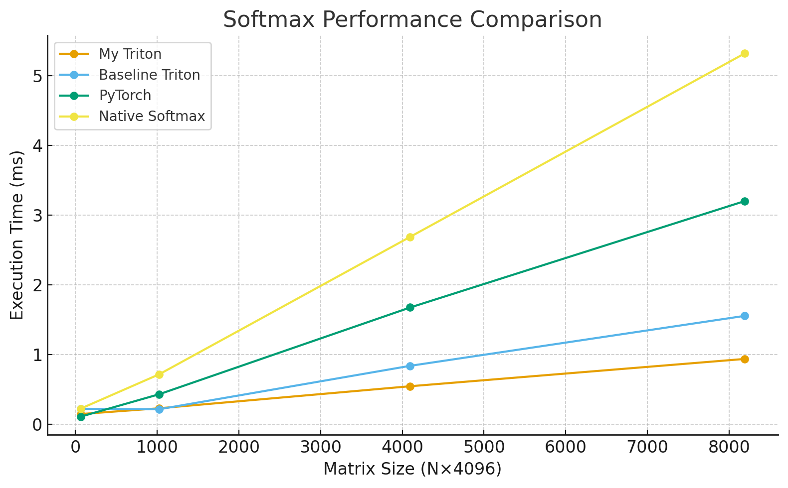
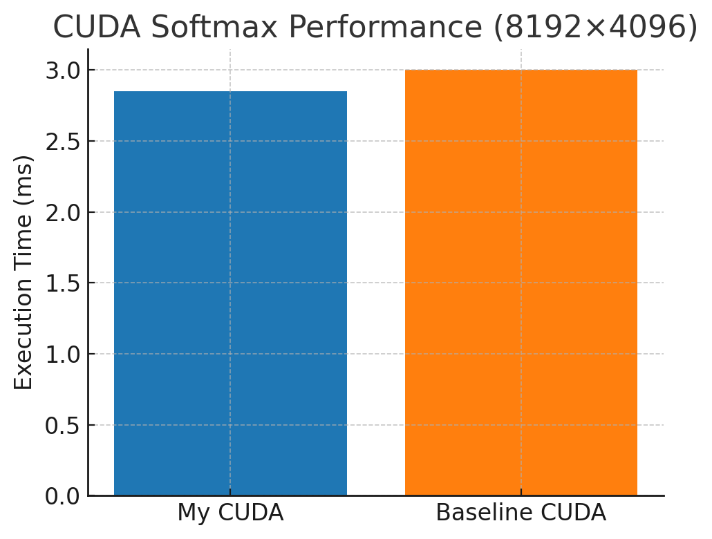
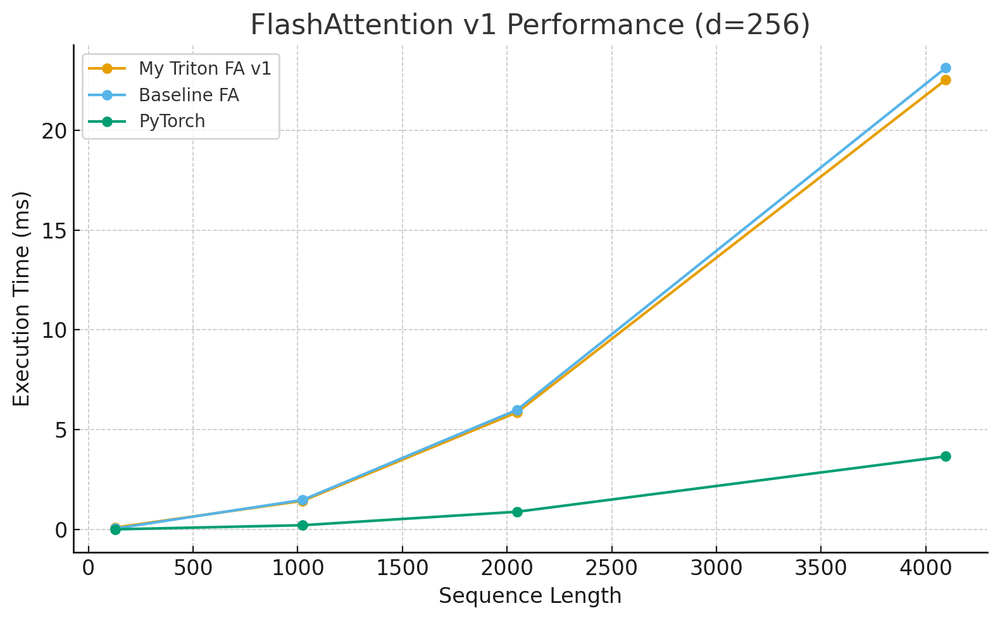
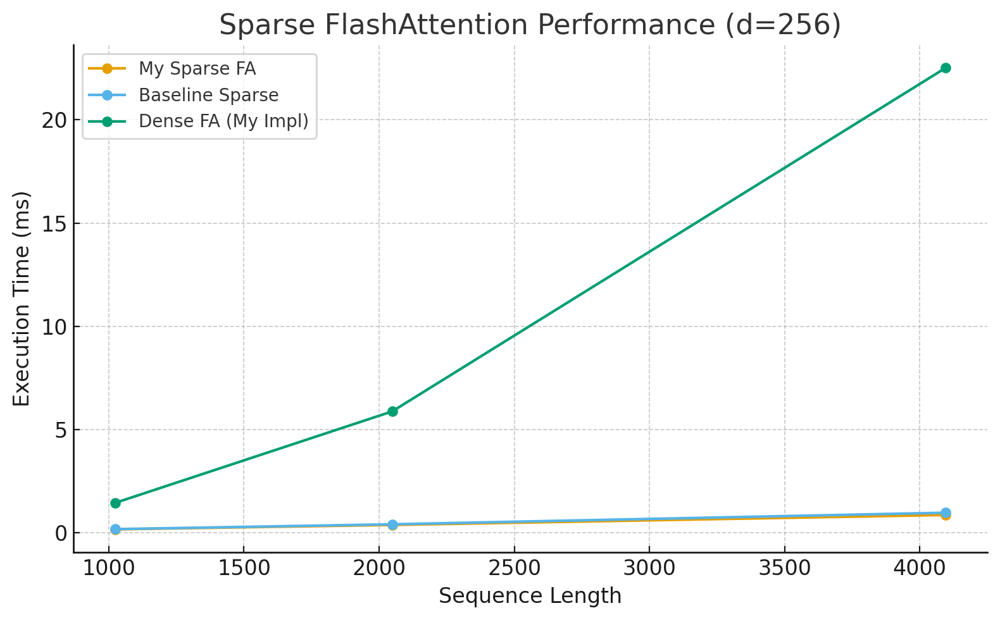
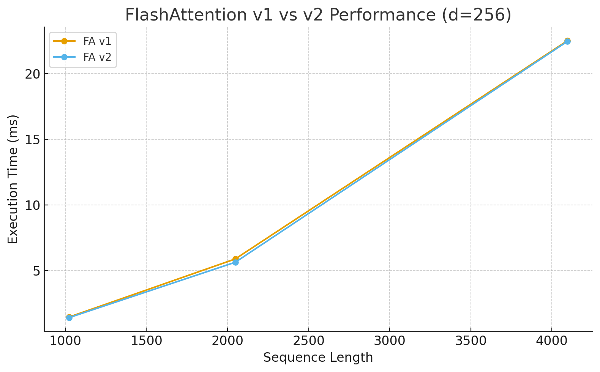

# Project 4: Parallel Programming with FlashAttention Report

## 1\. How to Compile and Execute

The project is compiled and executed according to the `README.md`.

### Execution

All jobs are submitted to the Slurm cluster using the provided script.

```bash
cd /path/to/project4/
sbatch ./scripts/sbatch_Part1.sh
sbatch ./scripts/sbatch_Part2.sh
sbatch ./scripts/sbatch_Part3.sh
```

## 2\. Algorithm Design and Implementation

### Task 1.1: Softmax with CUDA

Similar to cpu_softmax below, but use shared memory to accelerate

1. Let each block take charge of one row and let each thread take charge of several elements in one row
2. Calculate local_max for each thread
3. Calculate the gloabl maximum of one row
4. Calculate unnormalized result for each element and local_sum for each thread
5. Calculate the gloabl sum of one row
6. Normailize elements and dropout

### Task 1.2: Softmax with Triton

1. Let each program get their own row
2. Calculate input address
3. If HAS_MASK, then load mask and take intersection with boundary mask
4. Load input value and do normal safe softmax calculations
5. If HAS_DROPOUT, generate dropout mask and mask it with softmax output
6. Calculate output address and store output

### Task 2: FlashAttention with Triton

Similar to what algorithm states, the main difference is that in algorithm, the outer loop is in K, V and the inner loop is in Q. My implementation lets each program take charge of BLOCK_M rows and loop on K, V

To make it faster, I try to do division first on the small vector alpha and beta, which all are (BLOCK_M, ). This makes programs improves from 23.90ms to 22.52ms because it reduces doing division on whole matrix (BLOCK_M, d_model)

### Task 3: Sparse FlashAttention

Similar to Task 2 but add a single improvement: if the elements of K, V fall into the mask part, then return immediately.

### Extra Credit: FlashAttention Ver.2 in Triton

Similar to Task 2 but add a single improvement: no longer maintain complete output in the loop, but only maintain the numerator in the loop and do the division finnally, thus reduces non-matmul operations

To make it faster, I eliminate the compute of bata, simply changing the order of computing Pij after calculating m_i_new. Moreover, I try to use output = output \* alpha and output = tl.dot(p_ij, v_j, output) instead of output = output \* alpha + tl.dot(p_ij, v_j) to let compiler optimize easier.

## 3. Experiment Results

### 3.1 Task 1: Softmax Performance

| Matrix Size ($N \times N$) | My Triton (ms) | Baseline Triton (ms) | Speedup vs Baseline | PyTorch (ms) | Native Softmax (ms) |
| :------------------------- | :------------- | :------------------- | :------------------ | :----------- | :------------------ |
| $64 \times 4096$           | 0.144          | 0.220                | 1.53x               | 0.107        | 0.222               |
| $1024 \times 4096$         | 0.227          | 0.213                | 0.94x               | 0.428        | 0.714               |
| $4096 \times 4096$         | 0.543          | 0.836                | 1.54x               | 1.673        | 2.686               |
| $8192 \times 4096$         | 0.935          | 1.553                | 1.66x               | 3.200        | 5.319               |



| Matrix Size ($N \times N$) | My CUDA (ms) | Baseline CUDA (ms) | Speedup vs Baseline |
| :------------------------- | :----------- | :----------------- | :------------------ |
| $8192 \times 4096$         | 2.85         | 3                  | 1.05x               |



### 3.2 Task 2: FlashAttention v1 Performance ($d=256$)

| Seq Len | My Triton (ms) | Baseline FA (ms) | Speedup vs Baseline | PyTorch (ms) |
| :------ | :------------- | :--------------- | :------------------ | :----------- |
| 128     | 0.110          | 0.061            | 0.55x               | 0.021        |
| 1024    | 1.449          | 1.495            | 1.03x               | 0.228        |
| 2048    | 5.877          | 6.005            | 1.02x               | 0.901        |
| 4096    | 22.523         | 23.118           | 1.03x               | 3.674        |



### 3.3 Task 3: Sparse FlashAttention Performance ($d=256$)

| Seq Len | My Sparse FA (ms) | Baseline Sparse (ms) | Speedup vs Baseline | vs Dense FA (My Impl) |
| :------ | :---------------- | :------------------- | :------------------ | :-------------------- |
| 1024    | 0.167             | 0.177                | 1.06x               | 8.67x                 |
| 2048    | 0.379             | 0.412                | 1.09x               | 15.51x                |
| 4096    | 0.863             | 0.972                | 1.13x               | 26.10x                |



### 3.4 Extra Credit: FlashAttention v2 Comparison ($d=256$)

| Seq Len | FA v1 (ms) | FA v2 (ms) | Speedup vs FA v1 |
| :------ | :--------- | :--------- | :--------------- |
| 1024    | 1.449      | 1.406      | 1.03x            |
| 2048    | 5.877      | 5.626      | 1.04x            |
| 4096    | 22.523     | 22.476     | 1.002x           |



## 4. Performance Analysis

### 4.1 Softmax: Memory I/O Analysis

The results in Task 1 confirm that Softmax is memory-bound. The performance gap (1.66x speedup at $N=8192$) stems directly from the difference in HBM access patterns.

- **Pytorch:** PyTorch typically executes Softmax as a sequence of separate kernels.

  1.  **Pass 1 (Max):** Read $X$ from HBM $\rightarrow$ Compute Max $\rightarrow$ Write Max to HBM.
  2.  **Pass 2 (Exp & Sum):** Read $X$ and Max from HBM $\rightarrow$ Compute Exp & Sum $\rightarrow$ Write Sum to HBM.
  3.  **Pass 3 (Div):** Read $X$ and Sum from HBM $\rightarrow$ Compute Division $\rightarrow$ Write Output $Y$ to HBM.

  - **Total I/O:** Requires 3 passes of reading/writing the $N \times N$ matrix data.

- **Triton and CUDA:** My implementation fuses these steps into a single kernel.
  1.  **Single Pass:** Read $X$ block from HBM into SRAM once.
  2.  **SRAM/Register Ops:** Compute Max, Exp, Sum, and Divide entirely within on-chip memory. Masking and scaling are also applied here without extra HBM overhead.
  3.  **Output:** Write $Y$ block to HBM once.
  - **Total I/O:** Requires only 1 pass of reading and 1 pass of writing.

### 4.2 FlashAttention v1: Memory Traffic & IO Complexity

For Task 2 ($d=256$), the advantage of Triton lies in avoiding the materialization of the huge $N \times N$ attention matrix.

- **Torch (Standard Attention):**

  1.  **Score Calculation and Scale ($S = QK^T/sqrt(d)$):** Read 2 $\times$ $N \times N$ from HBM and writes the $N \times N$ matrix $S$ to HBM.
  2.  **Softmax:** Reads $S$ ($N^2$), writes $P$ ($N^2$) to HBM.
  3.  **Output Calculation ($O = PV$):** Reads $P$ ($N^2$) from HBM.

  - **Memory Traffic:** **$O(N^2)$**. It scales quadratically with sequence length. At $N=4096$, it reads/writes millions of floating-point numbers, saturating the bandwidth.

- **Triton (FlashAttention):**
  - **Tiling Strategy:** The algorithm loads blocks of $Q, K, V$ (size $B_r \times d$ and $B_c \times d$) into SRAM. `BLOCK_M=32` and `BLOCK_N=32` finding by Triton's autotune were chosen, which balances the need to reduce HBM accesses with the need to maintain high warp occupancy.
  - **On-Chip Accumulation:** Attention scores $S_{ij}$ and probabilities $P_{ij}$ are computed in SRAM. Crucially, they are immediately multiplied by $V$ to update the output accumulator $O$.
  - **Zero Intermediate HBM Writes:** The $N \times N$ matrices $S$ and $P$ are **never written to HBM**.
  - **Memory Traffic:** **$O(N \cdot d)$**. The IO complexity is linear with respect to sequence length.
  - **Analysis at $d=256$:** Although my implementation is compute-bound at this high dimension (due to Tensor Core limits), the strictly linear memory complexity prevents the Out of Memory errors and severe bandwidth throttling that Standard Attention suffers from at large $N$.

### 4.3 Sparse Attention: Skipping Memory Accesses

Task 3 demonstrates the most aggressive reduction in memory operations.

- **Dense Access:** Standard FlashAttention must load every block of $K$ and $V$ for every block of $Q$ to compute the full attention.
- **Sparse Access:** My kernel checks the `mask_ptr` metadata. If a block interaction is masked:
  - **Triton Behavior:** The kernel returns directly. No `tl.load` instructions are issued for $K$ or $V$ blocks.
  - **Result:** At $d=256$, where loading a $128 \times 256$ block is expensive (128KB of data), skipping these loads results in the observed **26x speedup** (0.86ms vs 22.52ms) at $N=4096$.

### 4.4 FlashAttention v2: Compute vs. Memory Trade-off (d=256)

Comparing v1 and v2 at $d=256$ reveals how hardware architecture dictates the optimal algorithm.

- **Algorithm Difference:** FA v2 reduces Non-Matmul FLOPs but has a similar memory access pattern to v1 (both are tiled).
- **Performance Parity:** On our GPU, v2 matched v1 at $d=256$ (-0.21% delta) but was slower at $d=128$.
- **Analysis:** This indicates that the bottleneck shifted from "Architecture Overhead" (at $d=128$) to "Compute Saturation" (at $d=256$). Since both algorithms have identical Memory Read/Write complexity, the difference is purely determined by how efficiently the Tensor Cores can process the tiled MatMul operations. The similar performance suggests that at $d=256$, the compute unit (Tensor Core) is fully saturated, making the memory access optimizations of FlashAttention the baseline requirement, while the specific algorithmic tweaks of v2 yield diminishing returns.
